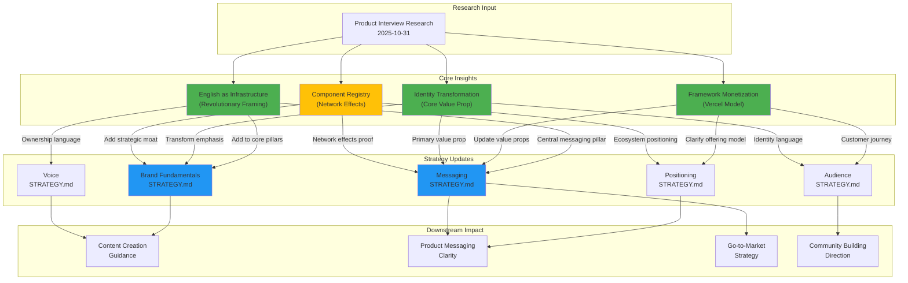

# Strategy Update Plan: Product Interview Integration

**Execution Folder:** `/brand/strategy/strategy-updates/2025-10-31@18:00/`
**Created:** 2025-10-31
**Research Source:** [Product Interview Research](/brand/research/product-interview/2025-10-31@17:01/RESEARCH.md)

---

## Executive Summary

This plan integrates critical product insights from the founder interview into existing brand strategy documents. The updates strengthen positioning clarity, emphasize identity transformation, and introduce powerful new framing ("English as Infrastructure") while removing deprecated naming (Vibeflow).

**Key Changes:**
1. **Shift primary value proposition** from "Build systems you own" → "Become a Marketing Architect"
2. **Integrate "English as Infrastructure" framing** as central messaging pillar
3. **Clarify framework vs. platform distinction** (remove Vibeflow references)
4. **Add component registry** as strategic moat (positioned as "coming soon")
5. **Strengthen identity transformation** emphasis across all documents

**Impact:** 5 strategy documents updated, 0 contradictions, significant messaging clarity gained.

---

## Strategic Context

### What Research Revealed

The [product interview research](/brand/research/product-interview/2025-10-31@17:01/RESEARCH.md) validated exceptional product-brand alignment (96%) while revealing four powerful insights not yet integrated into strategy:

1. **"English as Infrastructure"** - Revolutionary framing that makes ownership tangible
2. **Framework monetization model** - Vercel/Next.js analogy (free framework + paid tools)
3. **Identity transformation is core value prop** - Selling WHO customers become, not WHAT they get
4. **Component registry network effects** - Major strategic moat once launched

### Why This Matters

These insights don't contradict existing strategy—they **amplify and clarify** it. Current strategy is sound but can be significantly strengthened by integrating these framings explicitly.

---

## Impact Visualization



**Legend:**
- 🟢 Green = High-impact insights ready to integrate
- 🟡 Yellow = Aspirational (component registry not yet live)
- 🔵 Blue = Priority strategy documents for update

---

## Execution Phases

### Phase 1: Messaging Strategy Update (Highest Priority)

**Rationale:** Messaging is the most public-facing document and has widest downstream impact on content creation.

**Objective:** Integrate new framings into value propositions, update customer language, strengthen proof points.

**Key Changes:**

1. **Reframe Primary Value Proposition**
   - FROM: "Build marketing systems you own—not rent tools you'll outgrow"
   - TO: "Become a Marketing Architect who designs systems competitors can't replicate"
   - WHY: Identity transformation is the core value prop (per product interview)

2. **Add "English as Infrastructure" as Secondary Value Prop**
   - NEW: "Own your marketing infrastructure—where prompts, agents, and workflows are your codebase"
   - Integrate: "English is the new programming language; your system prompts are your infrastructure"
   - WHY: Makes abstract "ownership" concrete and defensible

3. **Clarify Framework vs. Platform Distinction**
   - Update references to distinguish:
     - Framework (open, free methodology)
     - Platform tools (usage-based, optional)
   - Remove "Vibeflow" name references (framework needs new name)

4. **Add Component Registry to Proof Points**
   - Position as "coming soon"
   - Network effects value proposition
   - Community-driven ecosystem

5. **Strengthen Identity Transformation Messaging**
   - Emphasize "who you become" over "what you get"
   - Include aha moment framing
   - Transform before/after from tools → identity

**Artifact Output:** `/artifacts/01-messaging-strategy-updates.md`

**Impacted File:** `/brand/strategy/messaging/STRATEGY.md`

---

### Phase 2: Brand Fundamentals Enhancement (Strategic Foundation)

**Rationale:** Brand fundamentals is the strategic anchor—updates here cascade to all other documents.

**Objective:** Add component registry as strategic moat, strengthen transformation narrative, integrate "English as Infrastructure" into pillars.

**Key Changes:**

1. **Add "Component Registry & Network Effects" to Strategic Moats**
   - Position under Strategic Foundations
   - Explain network effects flywheel
   - Mark as "coming soon" but strategically critical

2. **Integrate "English as Infrastructure" into Pillar 2**
   - "Own Your Stack, Own Your Destiny" pillar
   - Add explanation: prompts/agents/workflows = new infrastructure
   - Strengthens ownership positioning

3. **Enhance Customer Transformation Section**
   - Lead with identity transformation
   - Include "aha moment" description
   - Emphasize "working ON vs. IN the system"

4. **Update Mission Statement (Optional Refinement)**
   - Consider subtle shift to emphasize transformation
   - FROM: "Empower marketers to become architects..."
   - TO: "Transform marketers into Marketing Architects..."
   - (Subtle but positions transformation as active outcome)

5. **Remove Vibeflow References**
   - Replace with framework references
   - Maintain brand-agnostic strategic guidance

**Artifact Output:** `/artifacts/02-brand-fundamentals-updates.md`

**Impacted File:** `/brand/strategy/brand-fundamentals/STRATEGY.md`

---

### Phase 3: Positioning Strategy Clarification (Market Context)

**Rationale:** Positioning defines how we compete—clarifying framework model strengthens market differentiation.

**Objective:** Add Vercel/Next.js analogy, strengthen category ownership claims, integrate component registry positioning.

**Key Changes:**

1. **Add Framework Monetization Model Section**
   - Introduce Vercel/Next.js analogy explicitly
   - Explain three-layer architecture:
     - Framework (open/free)
     - Tools (usage-based)
     - Platform (account/billing)
   - WHY: Clarifies "what we sell" vs. competitors

2. **Strengthen Category Ownership Claims**
   - Add component registry as category differentiator
   - Position as "marketing component marketplace" (first-mover)
   - Emphasize marketingarchitect.ai domain ownership

3. **Update Competitive White Space Map**
   - Add "Framework vs. SaaS" dimension
   - Include "Identity Transformation" positioning
   - Highlight component registry as future moat

4. **Integrate "Cracked Marketers" Community Identity**
   - Add as cultural positioning element
   - Self-selection mechanism for ambitious minority
   - Community tribal identity

5. **Remove Vibeflow Brand References**
   - Replace with framework/platform terminology
   - Keep positioning brand-agnostic

**Artifact Output:** `/artifacts/03-positioning-updates.md`

**Impacted File:** `/brand/strategy/positioning/STRATEGY.md`

---

### Phase 4: Voice Strategy Enhancement (Communication Patterns)

**Rationale:** Voice guides how we communicate—new framings need voice integration for consistency.

**Objective:** Add "English as Infrastructure" to distinctive elements, strengthen ownership language patterns.

**Key Changes:**

1. **Add to Distinctive Elements**
   - Section: "English as Infrastructure" Framing
   - Include recurring phrases:
     - "Your prompts are your infrastructure"
     - "English is the new programming language"
     - "System prompts = your codebase"

2. **Strengthen Ownership Language Patterns**
   - Update recurring phrases
   - Add framework/platform distinction vocabulary
   - Remove Vibeflow-specific voice elements

3. **Add Identity Transformation Voice Patterns**
   - "From X to Y" framing templates
   - "Become a Marketing Architect" phrasing
   - Aha moment description language

4. **Update "What We Sound Like" Examples**
   - Include "English as Infrastructure" in examples
   - Add identity transformation framing
   - Show framework vs. platform distinction

**Artifact Output:** `/artifacts/04-voice-updates.md`

**Impacted File:** `/brand/strategy/voice/STRATEGY.md`

---

### Phase 5: Audience Strategy Refinement (Customer Understanding)

**Rationale:** Audience strategy defines who we serve—customer journey should reflect framework adoption path.

**Objective:** Update customer journey to reflect framework→tools path, add "cracked marketers" identity.

**Key Changes:**

1. **Update Customer Journey Section**
   - Clarify framework adoption (free) vs. tool adoption (paid)
   - Distinguish discovery → framework use → tool opt-in
   - Include aha moment in transformation section

2. **Add "Cracked Marketers" to Psychographic Profile**
   - Community identity language
   - Cultural positioning element
   - Self-selection mechanism

3. **Integrate Component Registry into Jobs-to-Be-Done**
   - Social job: Contribute to community registry
   - Functional job: Leverage shared components
   - Mark as "coming soon"

4. **Strengthen Identity Transformation in Aspirations**
   - Lead with "Become a Marketing Architect"
   - Emphasize identity shift over capability gain
   - Include transformation metrics (working ON vs. IN)

5. **Remove Vibeflow References**
   - Update to framework-agnostic language

**Artifact Output:** `/artifacts/05-audience-updates.md`

**Impacted File:** `/brand/strategy/audience/STRATEGY.md`

---

## Detailed Change Matrix

| Strategy Document | Priority | Changes | New Sections | Deprecated Elements |
|------------------|----------|---------|--------------|---------------------|
| **Messaging** | 🔴 HIGH | Primary value prop reframed<br/>"English as Infrastructure" added<br/>Component registry proof points | "English as Infrastructure" pillar<br/>Framework vs. Platform distinction | Vibeflow references |
| **Brand Fundamentals** | 🔴 HIGH | Component registry moat<br/>Enhanced transformation narrative<br/>Mission refinement | Network effects section<br/>"English as Infrastructure" in Pillar 2 | Vibeflow references |
| **Positioning** | 🟡 MEDIUM | Vercel/Next.js analogy<br/>Framework model clarification<br/>Category ownership strengthened | Framework monetization model<br/>"Cracked marketers" identity | Vibeflow references |
| **Voice** | 🟡 MEDIUM | "English as Infrastructure" patterns<br/>Identity transformation framing<br/>Ownership language enhanced | Distinctive element: Infrastructure framing<br/>Identity voice patterns | Vibeflow voice elements |
| **Audience** | 🟢 LOW | Customer journey clarified<br/>"Cracked marketers" added<br/>Registry in JTBD | Component registry aspirations<br/>Framework adoption path | Vibeflow references |

---

## Risk Assessment & Mitigation

### Risk 1: Component Registry Not Yet Live

**Risk:** Positioning aspirational features as "coming soon" may create expectation management issues.

**Mitigation:**
- Be explicit: "coming soon" language
- Position as strategic direction, not current capability
- Include in strategy (long-term) but be cautious in public messaging (short-term)
- Strategy documents = 3-5 year vision; marketing content = current reality

**Confidence:** LOW RISK (strategy documents are internal; external messaging can be conservative)

---

### Risk 2: Framework Naming Unclear

**Risk:** Removing "Vibeflow" without settled framework name creates brand ambiguity.

**Mitigation:**
- Use "Agentic Marketing Architecture" as working name
- Mark as "[Framework Name]" placeholder where needed
- Strategy remains valid regardless of eventual naming
- Framework naming is separate decision (not blocking strategy updates)

**Confidence:** LOW RISK (naming can be decided independently)

---

### Risk 3: Scope Creep into Product Strategy

**Risk:** This plan focuses on brand strategy; some insights warrant dedicated product strategy domain.

**Mitigation:**
- Keep scope limited to brand strategy updates
- Note product strategy implications in artifacts
- Recommend creating `/brand/strategy/product/` domain in separate workflow
- Clear boundary: This plan updates existing strategy based on new insights

**Confidence:** LOW RISK (clear scope definition prevents creep)

---

## Success Criteria

### Objective Measures

✅ **Completion:**
- 5 strategy documents updated
- 5 phase artifacts documenting changes
- All Vibeflow references removed
- All four key insights integrated

✅ **Consistency:**
- "English as Infrastructure" appears in Messaging, Brand Fundamentals, Voice
- Identity transformation emphasized in Messaging, Brand Fundamentals, Audience
- Framework vs. Platform clarified in Positioning, Messaging, Audience
- Component registry mentioned in Brand Fundamentals, Positioning, Audience

✅ **Quality:**
- All updates include research citations (markdown links)
- Changes maintain existing voice and structure
- No contradictions introduced
- Downstream content creation guidance improved

### Qualitative Validation

✅ **Marketing Architect Approval:**
- Plan reviewed and approved before implementation
- Any scope adjustments incorporated
- Clear on framework naming approach

✅ **Strategic Clarity:**
- Primary value proposition clear and compelling
- Framework vs. Platform distinction understandable
- Identity transformation messaging strengthened
- Ownership positioning more defensible

---

## Timeline & Effort Estimate

**Total Estimated Time:** 6-8 hours

| Phase | Estimated Time | Complexity |
|-------|----------------|------------|
| Phase 1: Messaging | 2 hours | MEDIUM (highest priority, most public-facing) |
| Phase 2: Brand Fundamentals | 2 hours | MEDIUM (strategic foundation, cascading impact) |
| Phase 3: Positioning | 1.5 hours | LOW (clarifications, additions) |
| Phase 4: Voice | 1 hour | LOW (pattern additions, examples) |
| Phase 5: Audience | 1 hour | LOW (journey updates, identity language) |
| **Review & QA** | 0.5-1 hour | - |

**Recommendation:** Execute phases sequentially (dependency: Messaging → Brand Fundamentals → others can be parallel).

---

## Dependencies & Prerequisites

### Required Before Starting

✅ **Research Available:** [Product Interview Research](/brand/research/product-interview/2025-10-31@17:01/RESEARCH.md) - COMPLETE

✅ **Existing Strategy Readable:** All 5 strategy documents accessible - COMPLETE

✅ **Marketing Architect Approval:** Plan reviewed and approved - PENDING (this review)

### Framework Naming Decision

⚠️ **Optional (Not Blocking):** Framework name can be decided independently
- For now: Use "Agentic Marketing Architecture" or "[Framework Name]" placeholder
- Strategy updates remain valid regardless of eventual naming
- Can do global find/replace once name is finalized

---

## Next Steps

### Immediate (This Session)

1. **Review this plan** with Marketing Architect
2. **Iterate based on feedback** (scope, priority, approach)
3. **Approve plan** to proceed to implementation

### After Approval

4. **Run `/implement`** to execute strategy updates
5. **Generate 5 phase artifacts** documenting all changes
6. **Update 5 strategy documents** with integrated insights
7. **Create summary document** of all changes for review

### Future Work (Separate Workflows)

- Create `/brand/strategy/product/` domain (dedicated product strategy)
- Update content creation workflows based on new messaging
- Develop framework naming (separate decision process)
- Plan component registry go-to-market strategy

---

## Artifact Structure

Each phase will generate a detailed artifact documenting changes:

```
/artifacts/
├── 01-messaging-strategy-updates.md
│   ├── Current State Analysis
│   ├── Proposed Changes (with rationale)
│   ├── Updated Sections (full text)
│   └── Impact Assessment
│
├── 02-brand-fundamentals-updates.md
│   ├── Current State Analysis
│   ├── Proposed Changes (with rationale)
│   ├── Updated Sections (full text)
│   └── Impact Assessment
│
├── 03-positioning-updates.md
│   ├── Current State Analysis
│   ├── Proposed Changes (with rationale)
│   ├── Updated Sections (full text)
│   └── Impact Assessment
│
├── 04-voice-updates.md
│   ├── Current State Analysis
│   ├── Proposed Changes (with rationale)
│   ├── Updated Sections (full text)
│   └── Impact Assessment
│
└── 05-audience-updates.md
    ├── Current State Analysis
    ├── Proposed Changes (with rationale)
    ├── Updated Sections (full text)
    └── Impact Assessment
```

Each artifact will include:
- **Before/after comparison** for major changes
- **Research citations** (markdown links to product interview)
- **Rationale** for each change
- **Impact assessment** (downstream effects)

---

## Approval Checklist

Before proceeding to implementation, confirm:

- [ ] **Scope is clear** - 5 strategy documents, 4 key insights, Vibeflow removal
- [ ] **Priorities are correct** - Messaging first, Brand Fundamentals second
- [ ] **Mermaid diagram accurately represents impact** - Research → Insights → Strategy → Downstream
- [ ] **Risk mitigation is acceptable** - Component registry timing, framework naming
- [ ] **Timeline is realistic** - 6-8 hours total, sequential execution
- [ ] **Success criteria are measurable** - Completion, consistency, quality checks
- [ ] **Framework naming approach is acceptable** - Placeholder for now, decide separately

---

## Questions for Marketing Architect

1. **Execution timing:** Execute all 5 phases in this session, or prioritize phases 1-2 today?

2. **Framework naming:** Use "Agentic Marketing Architecture" as placeholder, or prefer "[Framework Name TBD]"?

3. **Component registry positioning:** Comfortable with "coming soon" in strategy docs (knowing external messaging will be conservative until launch)?

4. **Mission statement refinement:** Approve subtle shift from "Empower marketers to become..." → "Transform marketers into..."?

5. **Scope additions:** Any other insights from product interview that should be integrated?

---

**Status:** DRAFT - Awaiting Marketing Architect approval

**Once approved, run:** `/implement` to execute this plan
