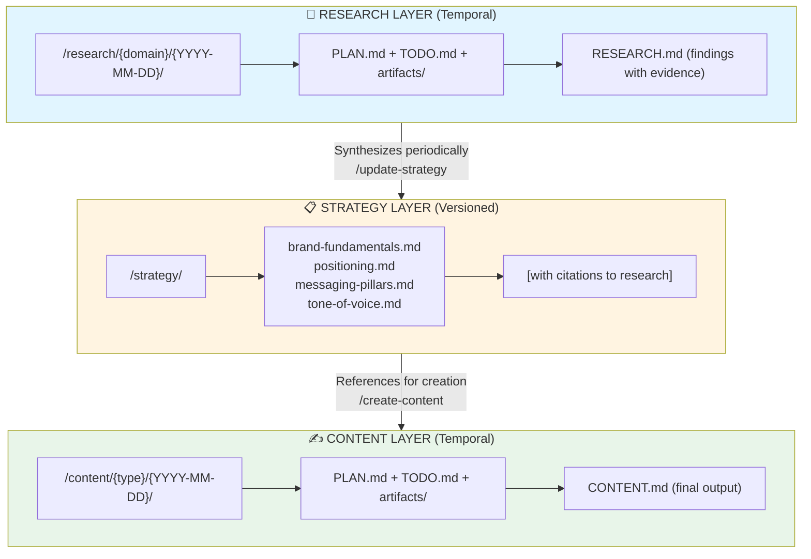
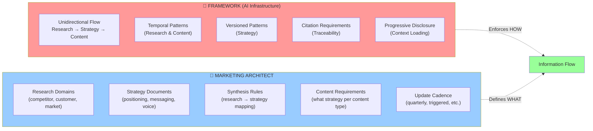
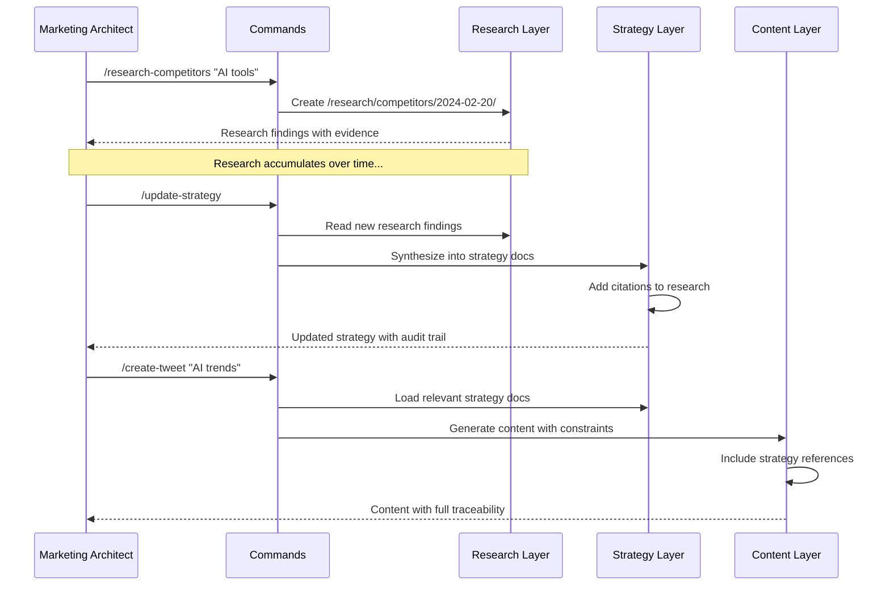
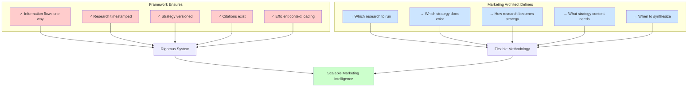

# AMA Content Framework Diagram

## Information Flow & Responsibilities

```mermaid
flowchart TD
    subgraph Research["🔬 RESEARCH LAYER (Temporal)"]
        R1["/research/{domain}/{YYYY-MM-DD}/"]
        R2["PLAN.md + TODO.md + artifacts/"]
        R3["RESEARCH.md (findings with evidence)"]
        R1 --> R2 --> R3
    end

    subgraph Strategy["📋 STRATEGY LAYER (Versioned)"]
        S1["/strategy/"]
        S2["brand-fundamentals.md<br/>positioning.md<br/>messaging-pillars.md<br/>tone-of-voice.md"]
        S3["[with citations to research]"]
        S1 --> S2 --> S3
    end

    subgraph Content["✍️ CONTENT LAYER (Temporal)"]
        C1["/content/{type}/{YYYY-MM-DD}/"]
        C2["PLAN.md + TODO.md + artifacts/"]
        C3["CONTENT.md (final output)"]
        C1 --> C2 --> C3
    end

    Research -->|"Synthesizes periodically<br/>/update-strategy"| Strategy
    Strategy -->|"References for creation<br/>/create-content"| Content

    style Research fill:#e1f5ff
    style Strategy fill:#fff4e1
    style Content fill:#e8f5e9
```

## Framework Constraints & Responsibilities

```mermaid
flowchart LR
    subgraph Framework["🔧 FRAMEWORK (AI Infrastructure)"]
        F1["Unidirectional Flow<br/>Research → Strategy → Content"]
        F2["Temporal Patterns<br/>(Research & Content)"]
        F3["Versioned Patterns<br/>(Strategy)"]
        F4["Citation Requirements<br/>(Traceability)"]
        F5["Progressive Disclosure<br/>(Context Loading)"]
    end

    subgraph Architect["👤 MARKETING ARCHITECT"]
        A1["Research Domains<br/>(competitor, customer, market)"]
        A2["Strategy Documents<br/>(positioning, messaging, voice)"]
        A3["Synthesis Rules<br/>(research → strategy mapping)"]
        A4["Content Requirements<br/>(what strategy per content type)"]
        A5["Update Cadence<br/>(quarterly, triggered, etc.)"]
    end

    Framework -.->|"Enforces HOW"| Flow["Information Flow"]
    Architect -.->|"Defines WHAT"| Flow

    style Framework fill:#ff9999
    style Architect fill:#99ccff
    style Flow fill:#99ff99
```

## Command-Based Workflow

```mermaid
sequenceDiagram
    participant MA as Marketing Architect
    participant Cmd as Commands
    participant R as Research Layer
    participant S as Strategy Layer
    participant C as Content Layer

    MA->>Cmd: /research-competitors "AI tools"
    Cmd->>R: Create /research/competitors/2024-02-20/
    R-->>MA: Research findings with evidence

    Note over MA,R: Research accumulates over time...

    MA->>Cmd: /update-strategy
    Cmd->>R: Read new research findings
    Cmd->>S: Synthesize into strategy docs
    S->>S: Add citations to research
    S-->>MA: Updated strategy with audit trail

    MA->>Cmd: /create-tweet "AI trends"
    Cmd->>S: Load relevant strategy docs
    Cmd->>C: Generate content with constraints
    C->>C: Include strategy references
    C-->>MA: Content with full traceability
```

## Responsibilities Matrix

```mermaid
graph TB
    subgraph "Framework Ensures"
        FE1[✓ Information flows one way]
        FE2[✓ Research timestamped]
        FE3[✓ Strategy versioned]
        FE4[✓ Citations exist]
        FE5[✓ Efficient context loading]
    end

    subgraph "Marketing Architect Defines"
        MAD1[→ Which research to run]
        MAD2[→ Which strategy docs exist]
        MAD3[→ How research becomes strategy]
        MAD4[→ What strategy content needs]
        MAD5[→ When to synthesize]
    end

    FE1 & FE2 & FE3 & FE4 & FE5 --> System[Rigorous System]
    MAD1 & MAD2 & MAD3 & MAD4 & MAD5 --> Flex[Flexible Methodology]

    System --> Result[Scalable Marketing Intelligence]
    Flex --> Result

    style FE1 fill:#ffcccc
    style FE2 fill:#ffcccc
    style FE3 fill:#ffcccc
    style FE4 fill:#ffcccc
    style FE5 fill:#ffcccc
    style MAD1 fill:#cce5ff
    style MAD2 fill:#cce5ff
    style MAD3 fill:#cce5ff
    style MAD4 fill:#cce5ff
    style MAD5 fill:#cce5ff
    style Result fill:#ccffcc
```
